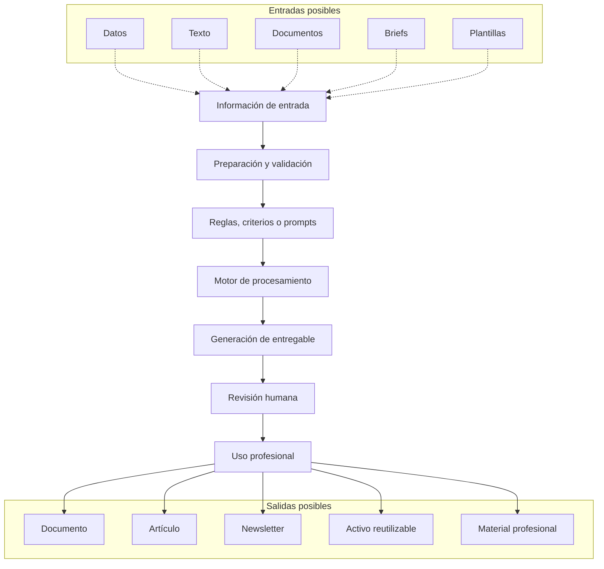
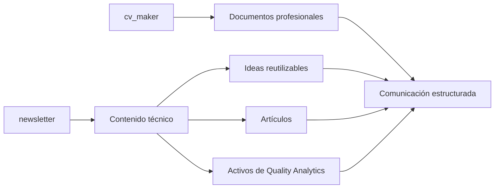
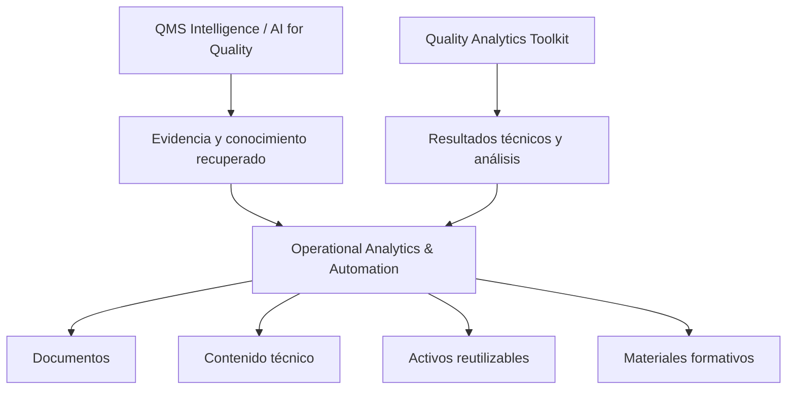

# Operational Analytics & Automation

Automatización, analítica operativa y generación de entregables profesionales para reducir trabajo manual, estandarizar flujos y convertir información en activos reutilizables.

Este repositorio funciona como índice curado de proyectos públicos orientados a transformar información, texto, documentos y criterios técnicos en entregables más estructurados, consistentes y útiles.

El enfoque no está en automatizar por automatizar.

El enfoque está en reducir fricción operativa para que la información llegue mejor preparada a quienes deben analizar, comunicar o decidir.

## Propósito

En muchos entornos profesionales, la mejora no se detiene por falta de herramientas.

Se detiene porque el trabajo operativo alrededor de la información consume demasiado tiempo:

- preparar documentos manualmente;
- rehacer entregables similares desde cero;
- convertir información dispersa en formatos útiles;
- organizar contenido técnico;
- transformar análisis en comunicación clara;
- mantener consistencia entre documentos, reportes y materiales;
- convertir conocimiento en activos reutilizables.

Operational Analytics & Automation busca reducir esa carga.

Su propósito es explorar y construir herramientas que ayuden a convertir información, contexto y estructura en entregables profesionales más consistentes, revisables y reutilizables.

## Idea central

La automatización aporta valor cuando mejora la calidad del trabajo, reduce variación innecesaria y libera tiempo para análisis de mayor valor.

No todo debe automatizarse.

Conviene automatizar cuando existe:

1. una tarea repetitiva;
2. una estructura reconocible;
3. una fuente de información;
4. una salida esperada;
5. criterios claros de validación;
6. revisión humana antes del uso final.

La tecnología debe apoyar el criterio profesional.

No debe producir entregables sin control, contexto o revisión.

## Mapa de repositorios públicos

| Área | Repositorio | Propósito |
|---|---|---|
| Generación documental | [cv_maker](https://github.com/fjgonzalezmgt/cv_maker) | Aplicación para generar CVs en HTML y LaTeX usando Streamlit, OpenAI, plantillas estructuradas, validaciones, prompts externos y pruebas unitarias. |
| Contenido técnico y activos editoriales | [newsletter](https://github.com/fjgonzalezmgt/newsletter) | Repositorio relacionado con contenido técnico, newsletter, activos editoriales y construcción de conocimiento reutilizable para Quality Analytics. |

## Líneas principales del proyecto

### 1. Automatización documental

Repositorio:

- [cv_maker](https://github.com/fjgonzalezmgt/cv_maker)

Esta línea se enfoca en generar documentos profesionales de forma más estructurada, repetible y revisable.

El objetivo es transformar información base, contexto y criterios de formato en documentos listos para edición, revisión o entrega.

Casos de uso típicos:

- generación de CVs personalizados;
- creación de documentos HTML o LaTeX;
- uso de plantillas estructuradas;
- validación de entradas y salidas;
- separación entre prompts, configuración y lógica;
- reducción de trabajo manual en documentos repetitivos;
- aplicación de IA generativa bajo estructura y control.

### 2. Contenido técnico y activos editoriales

Repositorio:

- [newsletter](https://github.com/fjgonzalezmgt/newsletter)

Esta línea conecta automatización, organización de conocimiento y construcción de activos profesionales.

El objetivo es convertir ideas técnicas, artículos, notas, guías o reflexiones en contenido más estructurado, reutilizable y alineado con Quality Analytics.

Casos de uso típicos:

- organización de newsletter;
- repositorio de ideas técnicas;
- construcción de biblioteca editorial;
- reutilización de contenido para LinkedIn, artículos o materiales;
- soporte a Quality Analytics como plataforma de conocimiento;
- conversión de experiencia técnica en activos reutilizables.

## Arquitectura conceptual

Un flujo de automatización operativa puede entenderse así:



La automatización debe incluir validación y revisión.

Un flujo que genera más entregables pero no mejora calidad, claridad o trazabilidad no aporta suficiente valor.

## Relación entre proyectos

Los repositorios públicos de esta línea se relacionan como un sistema de soporte para comunicación profesional y construcción de activos:



La lógica común es convertir información en entregables útiles.

Cada proyecto puede tener un formato distinto, pero ambos responden a una misma necesidad: reducir fricción entre información, comunicación y acción.

## Qué problemas busca resolver

### Trabajo manual repetitivo

Muchas tareas profesionales requieren estructura, pero se repiten con pequeñas variaciones.

La automatización permite reducir tiempo operativo y conservar consistencia.

### Entregables poco estandarizados

Cuando cada documento o pieza de contenido se construye desde cero, aumenta la variación.

Una estructura común mejora claridad y reduce retrabajo.

### Brecha entre análisis y comunicación

El valor del análisis disminuye si no se comunica bien.

Estas herramientas buscan convertir información técnica en formatos más utilizables para revisión, presentación o decisión.

### Baja reutilización

Muchas ideas, reportes o documentos se usan una vez y se pierden.

La organización en repositorios permite convertir entregables en activos reutilizables.

### Dependencia excesiva de trabajo artesanal

El criterio profesional debe concentrarse en análisis, interpretación y decisión.

No en tareas repetitivas de formato, conversión o armado de entregables.

## Qué no busca hacer

Este proyecto no busca:

- reemplazar la revisión profesional;
- producir documentos finales sin criterio humano;
- automatizar tareas sin entender el proceso;
- generar contenido sin estructura;
- aumentar volumen sin mejorar utilidad;
- sustituir análisis por plantillas;
- convertir IA en autoridad final sobre el contenido.

La automatización debe mejorar el flujo.

No debe ocultar falta de criterio.

## Principios de diseño

Los proyectos de esta línea deben seguir estos principios:

1. **Claridad de entrada**  
   La herramienta debe definir qué información necesita para trabajar bien.

2. **Validación**  
   Las entradas y salidas deben revisarse para reducir errores.

3. **Estructura reutilizable**  
   Los proyectos deben separar contenido, configuración, plantillas y lógica cuando sea posible.

4. **Salida editable**  
   El resultado debe poder revisarse, corregirse y adaptarse.

5. **Trazabilidad**  
   Debe quedar claro qué información se usó y cómo se transformó.

6. **Revisión humana**  
   Ningún entregable debe asumirse correcto solo porque fue generado automáticamente.

7. **Utilidad operativa**  
   El entregable debe ayudar a comunicar, decidir, formar o ejecutar mejor.

## Flujo típico de uso

Un flujo general puede verse así:

1. Definir el objetivo del entregable.
2. Preparar información de entrada.
3. Seleccionar una plantilla, estructura o criterio.
4. Ejecutar el flujo de automatización.
5. Revisar la salida.
6. Ajustar contenido, formato o precisión.
7. Exportar, publicar o reutilizar.
8. Guardar el resultado como activo profesional.

## Ejemplos de preguntas útiles

### Automatización documental

```text
¿Qué información mínima necesita este documento para generarse con calidad?
```

```text
¿Qué parte del documento debe ser fija y qué parte debe adaptarse al contexto?
```

### Contenido técnico

```text
¿Qué idea puede convertirse en artículo, post, checklist o módulo formativo?
```

```text
¿Qué parte de este contenido se puede reutilizar como activo de Quality Analytics?
```

### Automatización operativa

```text
¿Qué tarea se repite con suficiente frecuencia para justificar automatización?
```

```text
¿Qué validación evita que el flujo produzca resultados incorrectos?
```

### Reutilización

```text
¿Qué entregable puede servir como base para futuros proyectos?
```

```text
¿Qué conocimiento puede convertirse en plantilla, guía o sistema?
```

## Qué demuestra esta línea de proyectos

Esta línea demuestra capacidad para conectar:

- automatización;
- generación documental;
- comunicación profesional;
- organización de contenido;
- inteligencia artificial generativa;
- diseño de flujos profesionales;
- construcción de activos digitales;
- soporte a formación, consultoría y operaciones.

El énfasis está en convertir trabajo repetitivo en sistemas más consistentes.

No en producir más volumen sin criterio.

## Relación con Quality Analytics Toolkit

Esta línea complementa el [Quality Analytics Toolkit](https://github.com/fjgonzalezmgt/Quality-Analytics-Toolkit).

Mientras Quality Analytics Toolkit se enfoca en herramientas estadísticas y métodos de calidad, Operational Analytics & Automation se enfoca en los flujos que ayudan a preparar, transformar, comunicar y reutilizar información.

Ambas líneas comparten una misma lógica:

> convertir información disponible en mejores decisiones y mejores entregables.

## Relación con QMS Intelligence / AI for Quality

Esta línea también complementa [QMS Intelligence / AI for Quality](https://github.com/fjgonzalezmgt/QMS-Intelligence-AI-for-Quality).

QMS Intelligence se enfoca en recuperación de evidencia, documentación de calidad y sistemas RAG.

Operational Analytics & Automation se enfoca en convertir información estructurada o semi-estructurada en entregables útiles: documentos, contenido, artículos, recursos o materiales profesionales.

La relación puede verse así:



## Casos de uso posibles

### Consultoría

- preparación de documentos técnicos;
- estructuración de entregables;
- documentación de hallazgos;
- generación de materiales base;
- creación de activos reutilizables.

### Formación

- transformación de artículos en módulos;
- creación de guías;
- preparación de ejemplos;
- reutilización de contenido técnico;
- organización de materiales educativos.

### Calidad y operaciones

- preparación de análisis para revisión;
- generación de resúmenes;
- documentación de proyectos de mejora;
- comunicación de aprendizajes;
- conversión de evidencia en entregables claros.

### Marca profesional

- organización de contenido de Quality Analytics;
- reutilización de ideas para LinkedIn, newsletter o guías;
- construcción de activos digitales;
- estandarización de comunicación técnica.

## Criterios para automatizar

No toda tarea debe automatizarse.

Una tarea es buena candidata cuando cumple varias de estas condiciones:

- se repite con frecuencia;
- tiene una estructura reconocible;
- consume tiempo manual;
- usa datos o texto de entrada;
- produce una salida clara;
- tiene reglas de validación;
- genera valor si se estandariza;
- puede revisarse antes de usarse;
- reduce errores o retrabajo;
- libera tiempo para análisis o decisión.

## Roadmap

Mejoras previstas:

- estandarizar estructura de README en los repositorios relacionados;
- documentar flujos de entrada, procesamiento y salida;
- agregar ejemplos visuales de entregables;
- separar plantillas, prompts, configuración y lógica;
- crear casos de uso demostrativos;
- agregar validaciones más explícitas;
- documentar riesgos y limitaciones;
- conectar herramientas con flujos de Quality Analytics;
- convertir contenidos seleccionados en activos reutilizables.

## Criterios de éxito

Un flujo de Operational Analytics & Automation aporta valor si:

- reduce tiempo manual;
- mejora consistencia;
- disminuye retrabajo;
- conserva trazabilidad;
- facilita revisión;
- genera entregables reutilizables;
- mejora comunicación;
- apoya decisiones;
- libera tiempo para análisis de mayor valor.

No aporta valor si solo produce más documentos o más contenido sin mejorar claridad, criterio o utilidad.

## Sobre el proyecto

Operational Analytics & Automation es desarrollado por Francisco González como parte de Quality Analytics.

El propósito es construir herramientas y flujos que conecten automatización, documentación, comunicación profesional y reutilización de conocimiento para reducir fricción operativa y convertir información en activos útiles.

Focos principales:

- automatización documental;
- flujos de contenido técnico;
- inteligencia artificial generativa;
- comunicación profesional;
- productividad técnica;
- activos digitales para Quality Analytics;
- soporte a calidad, operaciones, consultoría y formación.

## Enlaces relacionados

- [cv_maker](https://github.com/fjgonzalezmgt/cv_maker)
- [newsletter](https://github.com/fjgonzalezmgt/newsletter)
- [Quality Analytics Toolkit](https://github.com/fjgonzalezmgt/Quality-Analytics-Toolkit)
- [QMS Intelligence / AI for Quality](https://github.com/fjgonzalezmgt/QMS-Intelligence-AI-for-Quality)
- [Perfil de GitHub](https://github.com/fjgonzalezmgt)
- [Quality Analytics](https://qualityanalytics.net)
- [LinkedIn](https://www.linkedin.com/in/franciscogonzalez)
