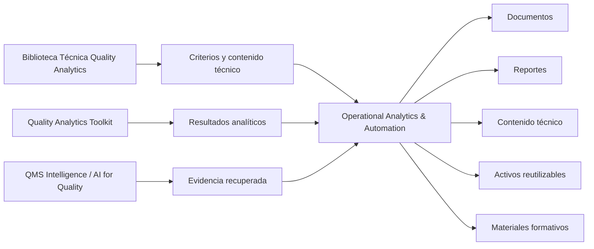
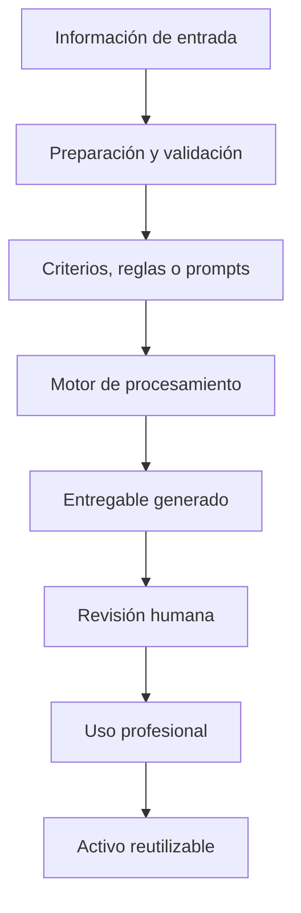

# Operational Analytics & Automation

Automatización, analítica operativa y generación de entregables profesionales para reducir trabajo manual, estandarizar flujos y convertir información en activos reutilizables.

Este repositorio es la línea de **Quality Analytics** enfocada en transformar información, texto, documentos y criterios técnicos en entregables más consistentes, revisables y útiles.

El foco no es automatizar por automatizar. El foco es reducir fricción para que la información llegue mejor preparada a quienes deben analizar, comunicar o decidir.

---

## Rol dentro del ecosistema

Esta línea convierte criterio, datos y evidencia en entregables que pueden revisarse, comunicarse y reutilizarse.

---

## Qué problemas atiende

| Si necesitas... | Enfoque relacionado | Resultado esperado |
|---|---|---|
| Reducir trabajo manual repetitivo | automatización documental | Menos tiempo en armado y formato |
| Generar documentos profesionales consistentes | plantillas y validaciones | Entregables más estandarizados y revisables |
| Convertir ideas técnicas en activos | organización editorial | Artículos, newsletters, checklists o materiales reutilizables |
| Preparar información para revisión | flujos estructurados | Información más clara para analizar o decidir |
| Separar contenido, formato y lógica | arquitectura de plantillas | Menos retrabajo y más control |
| Usar IA generativa con estructura | prompts, reglas y revisión | Salidas útiles sin perder criterio humano |

---

## Repositorios incluidos

| Área | Repositorio | Uso principal |
|---|---|---|
| Generación documental | [cv_maker](https://github.com/fjgonzalezmgt/cv_maker) | Generación de CVs en HTML y LaTeX usando Streamlit, plantillas, validaciones, prompts externos y pruebas unitarias |
| Contenido técnico y activos editoriales | [newsletter](https://github.com/fjgonzalezmgt/newsletter) | Organización de contenido técnico, newsletter, activos editoriales y conocimiento reutilizable para Quality Analytics |

---

## Flujo conceptual

La automatización debe incluir validación y revisión. Un flujo que genera más entregables pero no mejora calidad, claridad o trazabilidad no aporta suficiente valor.

---

## Casos de uso típicos

### Automatización documental

- Generación de CVs personalizados.
- Creación de documentos HTML o LaTeX.
- Uso de plantillas estructuradas.
- Validación de entradas y salidas.
- Separación entre prompts, configuración y lógica.
- Reducción de trabajo manual en documentos repetitivos.

### Contenido técnico y activos editoriales

- Organización de ideas técnicas.
- Preparación de artículos y newsletters.
- Reutilización de contenido para LinkedIn, guías o materiales formativos.
- Construcción de biblioteca editorial.
- Conversión de experiencia técnica en activos reutilizables.

### Calidad y operaciones

- Preparación de análisis para revisión.
- Generación de resúmenes técnicos.
- Documentación de proyectos de mejora.
- Comunicación de aprendizajes.
- Conversión de evidencia en entregables claros.

---

## Principios de diseño

- Claridad sobre la información de entrada.
- Validación de entradas y salidas.
- Separación entre contenido, configuración, plantillas y lógica.
- Salidas editables y revisables.
- Trazabilidad de la información utilizada.
- Revisión humana antes del uso final.
- Utilidad operativa: comunicar, decidir, formar o ejecutar mejor.

---

## Relación con la biblioteca técnica

Recursos y líneas relacionadas:

- [Biblioteca Técnica Quality Analytics](https://github.com/fjgonzalezmgt/fjgonzalezmgt/blob/main/TECHNICAL_LIBRARY.md)
- [Herramientas de excelencia operacional y calidad 2026](https://qualityanalytics.net/wp-content/uploads/2026/04/herramientas_excelencia_operacional_calidad_2026.pdf)
- [Validación de software open source en entornos regulados](https://qualityanalytics.net/wp-content/uploads/2026/04/guia_validacion_software_newsletter.pdf)

La biblioteca aporta criterio y contenido técnico. Esta línea ayuda a convertir ese contenido en documentos, materiales, flujos y activos profesionales.

---

## Parte del ecosistema Quality Analytics

- [Biblioteca Técnica Quality Analytics](https://github.com/fjgonzalezmgt/fjgonzalezmgt/blob/main/TECHNICAL_LIBRARY.md)
- [Quality Analytics Toolkit](https://github.com/fjgonzalezmgt/Quality-Analytics-Toolkit)
- [QMS Intelligence / AI for Quality](https://github.com/fjgonzalezmgt/QMS-Intelligence-AI-for-Quality)
- [Learning / Data Science Portfolio](https://github.com/fjgonzalezmgt/Learning-Data-Science-Portfolio)
